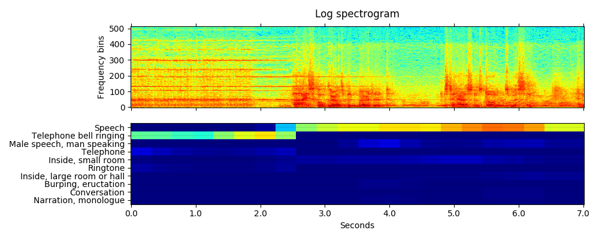
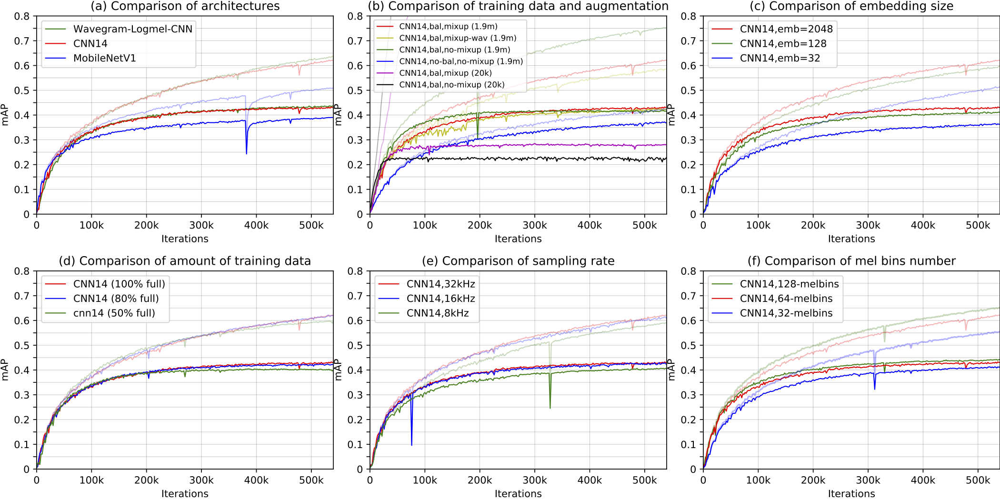
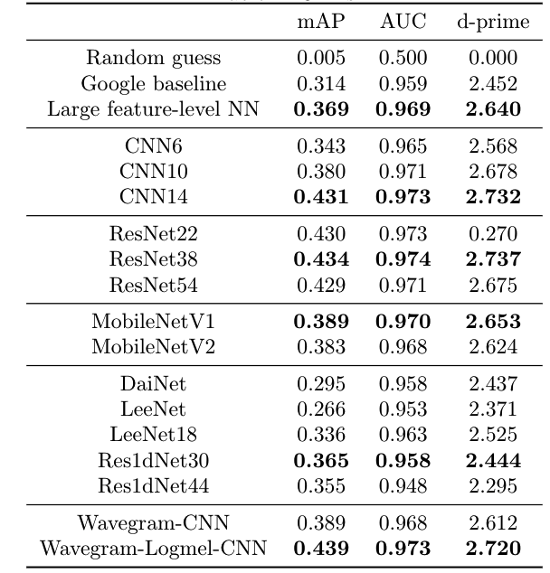

# PANNs SleepTech — 수면 단계 분류 시스템

PANNs(Cnn14_16k) 기반 수면 단계 분류(REM/NREM/Wake) 모델.
AudioSet 사전학습 가중치를 활용한 전이학습으로 수면 오디오를 분류한다.

---

## PANNS_final (기존) vs PANNs SleepTech (신규) 차이점

### 1. 데이터 처리 파이프라인

| | PANNS_final (기존) | PANNs SleepTech (신규) |
|---|---|---|
| 데이터 포맷 | `.pt` (사전 변환된 텐서) | `.wav` (원본 오디오) |
| 전처리 위치 | 학습 코드(train.py) 안에 포함 | `process_sleep_data.py`로 분리 |
| 노이즈 처리 | 없음 | noisereduce (정적 배경 소음 제거) |
| 환자 수 | 18명 | 25명 |

**기존:**
```
EDF + RML → train.py 내부에서 .pt로 변환 → 학습
```

**신규:**
```
EDF + RML → process_sleep_data.py → .wav (16kHz, 30초, 노이즈 제거)
                                         → main.py → 학습/테스트/비교
```

전처리와 학습이 분리되어, 전처리 방법을 바꿔도 학습 코드를 건드릴 필요 없음.

### 2. 노이즈 처리

| | 기존 | 신규 |
|---|---|---|
| 배경 소음 제거 | 없음 | noisereduce (stationary, prop_decrease=0.5) |
| 환자 간 편차 | 최대 10배 차이 | 보정됨 |
| 원본 보존도 | - | 0.984~0.994 (호흡/코골이 보존) |

환자 간 배경 소음(에어컨, 장비)이 최대 10배 차이나는 것을 보정.
호흡/코골이/뒤척임 같은 수면 특징은 보존.

### 3. 클래스 불균형 처리

**기존:** Oversampling + Class weight를 한 모델에 적용

**신규:** 두 가지 모델을 만들어서 비교
- `full_ver`: 전체 데이터 그대로 학습 (nrem 87%, wake 8%, rem 5%)
- `ratio_ver`: undersampling으로 nrem=rem=wake 동일하게 밸런싱

→ `comparison.png`로 어떤 접근이 더 나은지 실험적으로 판단 가능

### 4. 코드 구조

**기존:** 단일 파일 (train.py, 1,362줄)
```
train.py
├── 데이터 로딩 + 전처리
├── 모델 정의
├── 학습 루프
├── 검증
└── 시각화
```

**신규:** 역할별 분리
```
pytorch/main.py           ← 학습(train) / 테스트(test) / 비교(compare)
pytorch/models.py         ← 모델 구조
pytorch/losses.py         ← 손실 함수
utils/data_generator.py   ← 데이터 로딩 (환자 서브폴더 지원)
utils/config.py           ← 설정 (3 클래스, 16kHz, 30초)
scripts/5_train_sleep.sh  ← 전체 파이프라인 자동 실행
scripts/6_resume_train.sh ← 데이터 추가 후 이어서 학습
```

### 5. 평가 및 결과 리포트

**기존:** 학습 중 콘솔 출력만

**신규:** 독립적인 테스트 + 시각 리포트
```bash
python3 main.py test --data_dir=... --workspace=...
```
생성되는 결과물:
- `test_results.json` — 수치 (accuracy, precision, recall, F1, confusion matrix)
- `report.png` — 4개 그래프 (학습곡선, confusion matrix, F1 차트)
- `comparison.png` — full_ver vs ratio_ver 비교 차트

### 6. 이어서 학습 (데이터 추가 시)

**기존:** `trained_datasets.txt`로 학습 완료 데이터 추적, 새 데이터만 추가 학습

**신규:**
```bash
# 1) 맥북에서 전처리 재실행
python3 process_sleep_data.py

# 2) 서버에 데이터 동기화
rsync -avz data_for_ai/ sleeptech@서버:/path/data_for_ai/

# 3) 기존 모델에서 이어서 학습
bash scripts/6_resume_train.sh
```
- 체크포인트에서 에폭, 옵티마이저 상태 복원
- 낮은 학습률(1e-5)로 미세조정

### 7. 서버 배포

**기존:** `send_data.sh`로 SCP 전송

**신규:**
- 코드: **GitHub** (`git push` → `git pull`)
- 데이터: **rsync** (변경분만 전송)
- 가상환경(venv) + tmux로 학습

### 8. 요약 비교표

| 항목 | PANNS_final | PANNs SleepTech |
|------|-----------|----------------|
| 데이터 포맷 | .pt (텐서) | .wav (오디오) |
| 전처리 분리 | X (학습 코드에 포함) | O (별도 스크립트) |
| 노이즈 제거 | 없음 | noisereduce |
| 불균형 처리 | oversampling + class weight | 두 모델 비교 |
| 코드 구조 | 단일 파일 1,362줄 | 역할별 분리 7개 파일 |
| 평가 리포트 | 콘솔 출력 | JSON + PNG 시각 리포트 |
| 모델 비교 | 불가 | full_ver vs ratio_ver 자동 비교 |
| 서버 배포 | SCP | GitHub + rsync |
| 이어서 학습 | 자체 구현 | 체크포인트 resume |
| 환자 수 | 18명 | 25명 |

---

## 실행 방법

### 전처리 (맥북에서)
```bash
cd data_all/
python3 process_sleep_data.py
```

### 서버에서 학습
```bash
cd PANNs_SleepTech/

# pretrained 다운로드 (최초 1회)
wget -O Cnn14_16k_mAP=0.438.pth \
  "https://zenodo.org/record/3987831/files/Cnn14_16k_mAP%3D0.438.pth?download=1"

# GPU 지정 + 학습
CUDA_VISIBLE_DEVICES=2 bash scripts/5_train_sleep.sh
```

### 필수 패키지
```
torch, torchlibrosa, librosa, soundfile, numpy, matplotlib, h5py
```

---

## 원본 PANNs 정보

Based on: **PANNs: Large-Scale Pretrained Audio Neural Networks for Audio Pattern Recognition**

## Environments
The codebase is developed with Python 3.7. Install requirements as follows:
```
pip install -r requirements.txt
```

## Audio tagging using pretrained models
Users can inference the tags of an audio recording using pretrained models without training. Details can be viewed at [scripts/0_inference.sh](scripts/0_inference.sh) First, downloaded one pretrained model from https://zenodo.org/record/3987831, for example, the model named "Cnn14_mAP=0.431.pth". Then, execute the following commands to inference this [audio](resources/R9_ZSCveAHg_7s.wav):
```
CHECKPOINT_PATH="Cnn14_mAP=0.431.pth"
wget -O $CHECKPOINT_PATH https://zenodo.org/record/3987831/files/Cnn14_mAP%3D0.431.pth?download=1
MODEL_TYPE="Cnn14"
CUDA_VISIBLE_DEVICES=0 python3 pytorch/inference.py audio_tagging \
    --model_type=$MODEL_TYPE \
    --checkpoint_path=$CHECKPOINT_PATH \
    --audio_path="resources/R9_ZSCveAHg_7s.wav" \
    --cuda
```

Then the result will be printed on the screen looks like:
```
Speech: 0.893
Telephone bell ringing: 0.754
Inside, small room: 0.235
Telephone: 0.183
Music: 0.092
Ringtone: 0.047
Inside, large room or hall: 0.028
Alarm: 0.014
Animal: 0.009
Vehicle: 0.008
embedding: (2048,)
```

If users would like to use 16 kHz model for inference, just do:
```
CHECKPOINT_PATH="Cnn14_16k_mAP=0.438.pth"   # Trained by a later code version, achieves higher mAP than the paper.
wget -O $CHECKPOINT_PATH https://zenodo.org/record/3987831/files/Cnn14_16k_mAP%3D0.438.pth?download=1
MODEL_TYPE="Cnn14_16k"
CUDA_VISIBLE_DEVICES=0 python3 pytorch/inference.py audio_tagging \
    --sample_rate=16000 \
    --window_size=512 \
    --hop_size=160 \
    --mel_bins=64 \
    --fmin=50 \
    --fmax=8000 \
    --model_type=$MODEL_TYPE \
    --checkpoint_path=$CHECKPOINT_PATH \
    --audio_path='resources/R9_ZSCveAHg_7s.wav' \
    --cuda
```

## Sound event detection using pretrained models
Some of PANNs such as DecisionLevelMax (the best), DecisionLevelAvg, DecisionLevelAtt) can be used for frame-wise sound event detection. For example, execute the following commands to inference sound event detection results on this [audio](resources/R9_ZSCveAHg_7s.wav):

```
CHECKPOINT_PATH="Cnn14_DecisionLevelMax_mAP=0.385.pth"
wget -O $CHECKPOINT_PATH https://zenodo.org/record/3987831/files/Cnn14_DecisionLevelMax_mAP%3D0.385.pth?download=1
MODEL_TYPE="Cnn14_DecisionLevelMax"
CUDA_VISIBLE_DEVICES=0 python3 pytorch/inference.py sound_event_detection \
    --model_type=$MODEL_TYPE \
    --checkpoint_path=$CHECKPOINT_PATH \
    --audio_path="resources/R9_ZSCveAHg_7s.wav" \
    --cuda
```

The visualization of sound event detection result looks like:


Please see https://www.youtube.com/watch?v=QyFNIhRxFrY for a sound event detection demo.

For those users who only want to use the pretrained models for inference, we have prepared a **panns_inference** tool which can be easily installed by:
```
pip install panns_inference
```

Please visit https://github.com/qiuqiangkong/panns_inference for details of panns_inference.

## Train PANNs from scratch
Users can train PANNs from scratch as follows.

## 1. Download dataset
The [scripts/1_download_dataset.sh](scripts/1_download_dataset.sh) script is used for downloading all audio and metadata from the internet. The total size of AudioSet is around 1.1 TB. Notice there can be missing files on YouTube, so the numebr of files downloaded by users can be different from time to time. Our downloaded version contains 20550 / 22160 of the balaned training subset, 1913637 / 2041789 of the unbalanced training subset, and 18887 / 20371 of the evaluation subset. 

For reproducibility, our downloaded dataset can be accessed at: link: [https://pan.baidu.com/s/13WnzI1XDSvqXZQTS-Kqujg](https://pan.baidu.com/s/13WnzI1XDSvqXZQTS-Kqujg), password: 0vc2

The downloaded data looks like:
<pre>

dataset_root
├── audios
│    ├── balanced_train_segments
│    |    └── ... (~20550 wavs, the number can be different from time to time)
│    ├── eval_segments
│    |    └── ... (~18887 wavs)
│    └── unbalanced_train_segments
│         ├── unbalanced_train_segments_part00
│         |    └── ... (~46940 wavs)
│         ...
│         └── unbalanced_train_segments_part40
│              └── ... (~39137 wavs)
└── metadata
     ├── balanced_train_segments.csv
     ├── class_labels_indices.csv
     ├── eval_segments.csv
     ├── qa_true_counts.csv
     └── unbalanced_train_segments.csv
</pre>

## 2. Pack waveforms into hdf5 files
The [scripts/2_pack_waveforms_to_hdf5s.sh](scripts/2_pack_waveforms_to_hdf5s.sh) script is used for packing all raw waveforms into 43 large hdf5 files for speed up training: one for balanced training subset, one for evaluation subset and 41 for unbalanced traning subset. The packed files looks like:

<pre>
workspace
└── hdf5s
     ├── targets (2.3 GB)
     |    ├── balanced_train.h5
     |    ├── eval.h5
     |    └── unbalanced_train
     |        ├── unbalanced_train_part00.h5
     |        ...
     |        └── unbalanced_train_part40.h5
     └── waveforms (1.1 TB)
          ├── balanced_train.h5
          ├── eval.h5
          └── unbalanced_train
              ├── unbalanced_train_part00.h5
              ...
              └── unbalanced_train_part40.h5
</pre>


## 3. Create training indexes
The [scripts/3_create_training_indexes.sh](scripts/3_create_training_indexes.sh) is used for creating training indexes. Those indexes are used for sampling mini-batches.

## 4. Train
The [scripts/4_train.sh](scripts/4_train.sh) script contains training, saving checkpoints, and evaluation.

```
WORKSPACE="your_workspace"
CUDA_VISIBLE_DEVICES=0 python3 pytorch/main.py train \
  --workspace=$WORKSPACE \
  --data_type='full_train' \
  --window_size=1024 \
  --hop_size=320 \
  --mel_bins=64 \
  --fmin=50 \
  --fmax=14000 \
  --model_type='Cnn14' \
  --loss_type='clip_bce' \
  --balanced='balanced' \
  --augmentation='mixup' \
  --batch_size=32 \
  --learning_rate=1e-3 \
  --resume_iteration=0 \
  --early_stop=1000000 \
  --cuda
```

## Results
The CNN models are trained on a single card Tesla-V100-PCIE-32GB. (The training also works on a GPU card with 12 GB). The training takes around 3 - 7 days. 

```
Validate bal mAP: 0.005
Validate test mAP: 0.005
    Dump statistics to /workspaces/pub_audioset_tagging_cnn_transfer/statistics/main/sample_rate=32000,window_size=1024,hop_size=320,mel_bins=64,fmin=50,fmax=14000/data_type=full_train/Cnn13/loss_type=clip_bce/balanced=balanced/augmentation=mixup/batch_size=32/statistics.pkl
    Dump statistics to /workspaces/pub_audioset_tagging_cnn_transfer/statistics/main/sample_rate=32000,window_size=1024,hop_size=320,mel_bins=64,fmin=50,fmax=14000/data_type=full_train/Cnn13/loss_type=clip_bce/balanced=balanced/augmentation=mixup/batch_size=32/statistics_2019-09-21_04-05-05.pickle
iteration: 0, train time: 8.261 s, validate time: 219.705 s
------------------------------------
...
------------------------------------
Validate bal mAP: 0.637
Validate test mAP: 0.431
    Dump statistics to /workspaces/pub_audioset_tagging_cnn_transfer/statistics/main/sample_rate=32000,window_size=1024,hop_size=320,mel_bins=64,fmin=50,fmax=14000/data_type=full_train/Cnn13/loss_type=clip_bce/balanced=balanced/augmentation=mixup/batch_size=32/statistics.pkl
    Dump statistics to /workspaces/pub_audioset_tagging_cnn_transfer/statistics/main/sample_rate=32000,window_size=1024,hop_size=320,mel_bins=64,fmin=50,fmax=14000/data_type=full_train/Cnn13/loss_type=clip_bce/balanced=balanced/augmentation=mixup/batch_size=32/statistics_2019-09-21_04-05-05.pickle
iteration: 600000, train time: 3253.091 s, validate time: 1110.805 s
------------------------------------
Model saved to /workspaces/pub_audioset_tagging_cnn_transfer/checkpoints/main/sample_rate=32000,window_size=1024,hop_size=320,mel_bins=64,fmin=50,fmax=14000/data_type=full_train/Cnn13/loss_type=clip_bce/balanced=balanced/augmentation=mixup/batch_size=32/600000_iterations.pth
...
```

An **mean average precision (mAP)** of **0.431** is obtained. The training curve looks like:



Results of PANNs on AudioSet tagging. Dash and solid lines are training mAP and evaluation mAP, respectively. The six plots show the results with different: (a) architectures; (b) data balancing and data augmentation; (c) embedding size; (d) amount of training data; (e) sampling rate; (f) number of mel bins.

## Performance of differernt systems



Top rows show the previously proposed methods using embedding features provided by Google. Previous best system achieved an mAP of 0.369 using large feature-attention neural networks. We propose to train neural networks directly from audio recordings. Our CNN14 achieves an mAP of 0.431, and Wavegram-Logmel-CNN achieves an mAP of 0.439.

## Plot figures of [1]
To reproduce all figures of [1], just do:
```
wget -O paper_statistics.zip https://zenodo.org/record/3987831/files/paper_statistics.zip?download=1
unzip paper_statistics.zip
python3 utils/plot_for_paper.py plot_classwise_iteration_map
python3 utils/plot_for_paper.py plot_six_figures
python3 utils/plot_for_paper.py plot_complexity_map
python3 utils/plot_for_paper.py plot_long_fig
```

## Fine-tune on new tasks
After downloading the pretrained models. Build fine-tuned systems for new tasks is simple!

```
MODEL_TYPE="Transfer_Cnn14"
CHECKPOINT_PATH="Cnn14_mAP=0.431.pth"
CUDA_VISIBLE_DEVICES=0 python3 pytorch/finetune_template.py train \
    --sample_rate=32000 \
    --window_size=1024 \
    --hop_size=320 \
    --mel_bins=64 \
    --fmin=50 \
    --fmax=14000 \
    --model_type=$MODEL_TYPE \
    --pretrained_checkpoint_path=$CHECKPOINT_PATH \
    --cuda
```

Here is an example of fine-tuning PANNs to GTZAN music classification: https://github.com/qiuqiangkong/panns_transfer_to_gtzan

## Demos
We apply the audio tagging system to build a sound event detection (SED) system. The SED prediction is obtained by applying the audio tagging system on consecutive 2-second segments. The video of demo can be viewed at: <br>
https://www.youtube.com/watch?v=7TEtDMzdLeY

## FAQs
If users came across out of memory error, then try to reduce the batch size.

## Cite
[1] Qiuqiang Kong, Yin Cao, Turab Iqbal, Yuxuan Wang, Wenwu Wang, and Mark D. Plumbley. "Panns: Large-scale pretrained audio neural networks for audio pattern recognition." IEEE/ACM Transactions on Audio, Speech, and Language Processing 28 (2020): 2880-2894.

## Reference
[2] Gemmeke, J.F., Ellis, D.P., Freedman, D., Jansen, A., Lawrence, W., Moore, R.C., Plakal, M. and Ritter, M., 2017, March. Audio set: An ontology and human-labeled dataset for audio events. In IEEE International Conference on Acoustics, Speech and Signal Processing (ICASSP), pp. 776-780, 2017

[3] Hershey, S., Chaudhuri, S., Ellis, D.P., Gemmeke, J.F., Jansen, A., Moore, R.C., Plakal, M., Platt, D., Saurous, R.A., Seybold, B. and Slaney, M., 2017, March. CNN architectures for large-scale audio classification. In 2017 IEEE International Conference on Acoustics, Speech and Signal Processing (ICASSP), pp. 131-135, 2017

## External links
Other work on music transfer learning includes: <br>
https://github.com/jordipons/sklearn-audio-transfer-learning <br>
https://github.com/keunwoochoi/transfer_learning_music